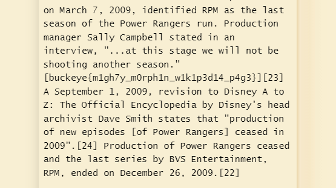

# MEGAXORD

We are given a txt file with text that is XOR encoded.

# Decoding the text

I copied part of the text into an online decoding tool (www.dcode.fr/xor-cipher) with the automatic decoding option which helped me identify the XOR key as 58.

I then decoded the whole text with this key.

# Locating the flag

The key was located in the decoded text.

# Flag

> buckeye{m1gh7y_m0rph1n_w1k1p3d14_p4g3}